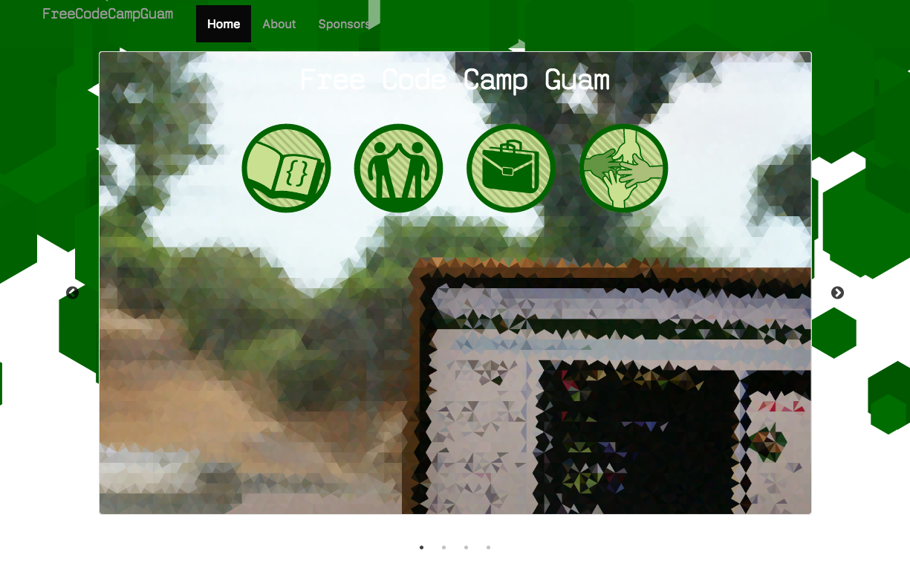

# 100 Days Of Code - Log

### Day 3: January 4rd, 2017

**Today's Progress**: FCCG-Website - messing with the splash bg and some styling. Happy with the slow progress.
Got distracted by the fact that PICO-8 allows you to save whole cartridges as `png` files! Updated Day 1's log to include its cart and a link to the repo.  

**Thoughts**: Was inspired by @michaelmang's [pages](https://twitter.com/michaelmangial1/status/816678746166009856). Will probably look that way for styling direction, cause man is it difficult for me to style.

**Link(s) to work**: [479e896](https://github.com/Chovin/freecodecampguam.github.io/commit/479e8965588e34f778471f488811cde4ad230b1e)
: Rolling changes can *probably* be viewed [here](https://chovin.github.io/freecodecampguam.github.io/)

### Day 2: January 3rd, 2017

**Today's Progress**: FCCG-Website messing around with the splash and carousel layout. Added a WIP p5.js background (cause I don't have any drawing tools :P)  

* No animations:  
  
* With animations looks *ok* on mobile. pretty sparce otherwise:  
  
Likely way too distracting. If use it at all, should just wiggle it or apply mouse-over parallax

**Thoughts**: I just avoided js's wonderful self/this 'features', not worth making nice OOP if I need to with bother debugging it. Wondering if I should animate the p5. Would suck up more cpu but very slight animation might be nice.  
Section off page.. sections. greeny background up top, white pages below?

**Link(s) to work**: [90b1696](https://github.com/FreeCodeCampGuam/freecodecampguam.github.io/commit/90b1696f783b4c811c43a6892d15ebf7b9b5db8c)

### Day 1: January 3rd, 2017

**Today's Progress**: Slow start. Meant to spend most of the time on the FCCG-Website but got caught up in management. Ended up just spending some time with Pico-8.

**Thoughts:** New to game dev. Going to make projects to prepare for the bootcamp in February.  
Thinking of making levels much like [@TRASEVOL_DOG](https://twitter.com/TRASEVOL_DOG)'s [one room dungeon](https://trasevol-dog.itch.io/one-room-dungeon)  

[Tweet:](https://twitter.com/Guamfella/status/816295768361271296) 
>Listening to #CoffeeWithButterscotch #57 [https://soundcloud.com/butterscotch-shenanigans/ep57-coffee-w-butterscotch-clairvoyant-druid-dad](https://soundcloud.com/butterscotch-shenanigans/ep57-coffee-w-butterscotch-clairvoyant-druid-dad) …. Think I might do the #TrainingDungeon also.. 😬 #100daysofcode #GuamCoders 

That means 2 games, one a week, then 2 games, one every 3 days, then 4-5 games, one every day.. oh boy..

**Link to work:** Coming in future logs ;)

<!-- 
### Day 0: February 30, 2016 (Example 2)
##### (delete me or comment me out)

**Today's Progress**: Fixed CSS, worked on canvas functionality for the app.

**Thoughts**: I really struggled with CSS, but, overall, I feel like I am slowly getting better at it. Canvas is still new for me, but I managed to figure out some basic functionality.

**Link(s) to work**: [Calculator App](http://www.example.com)

### Day 1: June 27, Monday

**Today's Progress**: I've gone through many exercises on FreeCodeCamp.

**Thoughts** I've recently started coding, and it's a great feeling when I finally solve an algorithm challenge after a lot of attempts and hours spent.

**Link(s) to work**
1. [Find the Longest Word in a String](https://www.freecodecamp.com/challenges/find-the-longest-word-in-a-string)
2. [Title Case a Sentence](https://www.freecodecamp.com/challenges/title-case-a-sentence) 
-->
